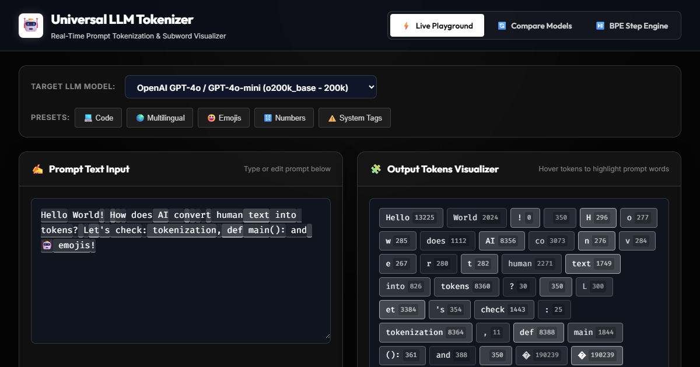

<div align="center">



# 🤖 Universal LLM Tokenizer & Visualizer

### *Paste a prompt. Watch 24 AI models fight over it - token by token.*

**See exactly how GPT-5.6, Claude Fable 5, Gemini 3.1, Llama 4, Kimi K3, DeepSeek V4 & 20 more models slice your text into subword tokens - live, color-coded, with byte-exact token IDs.**

[](https://indranil122.github.io/universal-llm-tokenizer/)
[]()
[]()
[]()
[](https://github.com/indranil122/universal-llm-tokenizer/stargazers)
[](https://github.com/indranil122/universal-llm-tokenizer/blob/main/README.md#contributing)

**Open-source · Free forever · Works offline · Runs entirely in your browser**

[🚀 Launch the tool](https://indranil122.github.io/universal-llm-tokenizer/) · [🎓 Learn Academy](https://indranil122.github.io/universal-llm-tokenizer/app.html#learn) · [⚔️ Model Battle](https://indranil122.github.io/universal-llm-tokenizer/app.html) · [🤝 Contribute](#contributing)

</div>

---

## 📑 Contents

[Why tokenization matters](#-why-tokenization-matters) · [Try it in 10 seconds](#-try-it-in-10-seconds) · [Features](#-why-youll-love-it) · [Supported Models](#-supported-models) · [How It Works](#️-how-it-works) · [vs Alternatives](#-how-it-compares) · [FAQ](#-faq) · [Learning Resources](#-learning-resources) · [Contributing](#contributing)

---

## 🔥 Why tokenization matters

Understanding **tokenization** is the #1 hidden skill in the AI world - it decides your **API costs**, your **context limits**, and even your **model's intelligence**:

- 💸 **It's your bill.** Every API call is priced per token. Non-English text can cost **2–10× more** for the same sentence.
- 📏 **It's your limit.** A "1M context window" counts tokens, not words - and some scripts burn through it fast.
- 🧠 **It's your quality.** Why can't LLMs count the letters in *strawberry*? Why do they fumble at reversing strings? **Tokenization.** One token = one opaque ID; the model never sees individual letters.
- 🌍 **It's why AI feels "English-first."** Devanagari, Tamil, CJK, Arabic and emoji all explode into many more tokens than English.

This tool makes all of that **visible**, live, in your browser.

---

## ⚡ Try it in 10 seconds

Open the [live demo](https://indranil122.github.io/universal-llm-tokenizer/) and:

1. Type `Hello World!` → **3 tokens** on GPT-5.6. Clean.
2. Type `नमस्ते` or `こんにちは` → the same idea becomes **10+ tokens**. *That's* the non-English penalty.
3. Hit the `[ SYSTEM TAGS ]` preset → meet [`SolidGoldMagikarp`](https://www.lesswrong.com/posts/aPeJE8bSo6rAFoLqg/solidgoldmagikarp-plus-prompt-generation-glitches), the famous glitch token.
4. Open the `[ ALL MODELS ]` tab → watch all 24 models battle over your text, ranked by tokens & cost.

> 🎬 Then hover any token pill: you get its exact ID, UTF-8 bytes, hex, and character range.

---

## ✨ Why you'll love it

- ⚡ **Real-time tokenization** — every keystroke instantly re-tokenizes your prompt
- 🧩 **Color-coded token pills** with **exact token IDs** (hover for UTF-8 bytes, hex, character ranges)
- 🎯 **EXACT tokenization** — **11 byte-exact vocabularies embedded**: GPT-5.x / GPT-4o / GPT-4.1 / GPT-4 / GPT-3, gpt-oss (`o200k_harmony`), Llama, **Qwen3 + Qwen3.5**, and **Cohere Command A+** (official published file)
- ⚔️ **All-models battle table** — run one prompt through all 24 models, ranked by token count, cost & context usage
- 🎮 **Guess-the-Tokens game** — train your token intuition against GPT-5.6 with streaks and a saved best score
- 🏛️ **Quirks Museum** — one-click exhibits for the strawberry problem, the trailing-space trap, SolidGoldMagikarp, the non-English tax, number slicing and ZWJ emoji
- 🧪 **Train-your-own BPE lab** — paste a corpus and watch a tokenizer vocabulary emerge from raw bytes, minbpe-style, live in your browser
- 💸 **Cost Lab** — drag & drop any text file and see what all 24 models would charge for it, ranked
- 🔗 **Shareable permalinks** — one click copies a URL that reopens your exact prompt + model
- 🐍 **Copy-as-code** — grab a ready-to-run Python `tiktoken` snippet or export every token as JSON/CSV
- 🧾 **Context-window meter** — see exactly what % of each model's window your prompt consumes
- 🌐 **Script detection** — instantly see which scripts (Devanagari, CJK, Arabic, Emoji…) are inflating your count
- ▦ **Token bar view** — flip pills into byte-length bars for a screenshot-worthy overview
- 🔄 **Side-by-side comparison** — watch GPT-5.6 vs Llama 4 vs Gemini 3.1 disagree on the same sentence
- 📊 **Word ➜ Token matrix** — which words explode into multiple tokens?
- ⏯️ **Step-by-step BPE engine** — watch raw characters literally *merge* into subwords
- 🖱️ **Hover-sync highlighting** — hover a pill and watch it light up inside your text
- 🎓 **Built-in LEARN Academy** — Karpathy & 3Blue1Brown courses that play *inside* the app (`app.html#learn`)
- 🌗 **Dark/light brutalist UI** — zero frameworks, instant load

---

## 🧠 Supported Models

The lineup tracks the **models that are actually live right now** (August 2026), refreshed against vendor announcements and tokenizer research. Retired models are kept — clearly labeled — because their tokenizers are still worth studying.

| Model | Tokenizer Engine | Vocab Size | Context | Status |
|---|---|---|---|---|
| OpenAI **GPT-5.6 Sol / Terra / Luna** | ✅ Exact BPE (`o200k_base`) | 200,000 | 400k | 🟢 Current |
| OpenAI **GPT-5** family | ✅ Exact BPE (`o200k_base`) | 200,000 | 400k | 🟢 Current |
| OpenAI **gpt-oss-120b / 20b** (open weights) | ✅ Exact BPE (`o200k_harmony`) — full 1,090-token harmony special block | 201,088 | 128k | 🟢 Current |
| OpenAI GPT-4.1 | ✅ Exact BPE (`o200k_base`) | 200,000 | 1M | 🟡 Legacy API |
| OpenAI GPT-4o / GPT-4o-mini | ✅ Exact BPE (`o200k_base`) | 200,000 | 128k | 🟡 Legacy |
| OpenAI GPT-4 / GPT-3.5 Turbo | ✅ Exact BPE (`cl100k_base`) | 100,000 | 8k | ⚪ Retired |
| OpenAI GPT-3 / GPT-2 / Codex | ✅ Exact BPE (`p50k_base`) | 50,000 | 2,049 | ⚪ Retired |
| Meta **Llama 4** Scout / Maverick | Tiktoken BPE — real vocab is **202,048**, approximated here with Llama 3's embedded 128k file* | 202,048 | 10M (Scout) / 1M (Maverick) | 🟢 Current |
| Meta Llama 2 / Llama 1 | SentencePiece | 32,000 | 4k | ⚪ Retired |
| Anthropic **Claude Fable 5 / Mythos 5** | Minimum-piece segmentation* (community-reverse-engineered) | ≈16,200 (est.) | 1M | 🟢 Current |
| Anthropic **Claude Opus 5 / Sonnet 5** | Minimum-piece segmentation* (post-4.7 tokenizer) | ≈16,200 (est.) | 1M | 🟢 Current |
| Google **Gemini 3.1 Pro / 3.5 Flash** | SentencePiece (Unigram)* | 256,000 | 1M | 🟢 Current |
| Google Gemini 3 Pro / 3 Flash | SentencePiece (Unigram)* | 256,000 | 1M | 🟢 Current |
| Google BERT | WordPiece | 30,522 | 512 | ⚪ Retired |
| DeepSeek **V4 Pro / Flash** (+ V3.2) | Byte-fallback BPE* | 129,280 | 1M | 🟢 Current |
| Moonshot **Kimi K3 / K2.5** | Tiktoken BPE* | 163,584 | 1M | 🟢 Current |
| Alibaba **Qwen 3.5 / 3.6 / 3.8** | ✅ Exact byte-fallback BPE (Qwen3.5 published tokenizer) | 248,320 | 256k→1M | 🟢 Current |
| Alibaba Qwen3 / Qwen Coder (legacy) | ✅ Exact byte-fallback BPE (Qwen3 published tokenizer) | 151,646 | 256k | 🟡 Legacy |
| Zhipu **GLM-5 / GLM-5.2** | Byte-fallback BPE (`glm5` encoding)* | 154,856 | 1M | 🟢 Current |
| MiniMax **M2.5 / M2.1 / M2** | Byte-fallback BPE (`minimax_m2` encoding)* | 200,054 | ~200k | 🟢 Current |
| Mistral Large 3 | Tekken BPE* | 131,072 | 256k | 🟢 Current |
| xAI **Grok 4 / 4.5 / 4.6** | BPE* (unpublished — community estimate ≈131k, cl100k-like) | ≈131,072 (est.) | 256k–2M by SKU | 🟢 Current |
| Cohere **Command A+ / Command A** | ✅ Exact BPE (official published tokenizer file) | 255,000 | 256k | 🟢 Current |

**24 models · 4 tokenizer engines · 11 byte-exact vocabularies · 0 servers**

> ✅ **Exact** = the real vocabulary file is embedded and token IDs are byte-identical to the official tokenizer.
> 🟢 **Current** = actively served by the vendor today. 🟡 = available but deprecated.
> \* = these vendors don't publish their tokenizer files, so their engine is a faithful approximation (clearly labeled in-app). Anthropic doesn't publish its tokenizer; community reverse-engineering (2026) indicates minimum-piece segmentation rather than classic byte-BPE — labeled as estimates in-app.

---

## 🚀 Quick Start

**Option 1 — Just use it:** open the [live demo](https://indranil122.github.io/universal-llm-tokenizer/). No install, no API keys, no signup.

**Option 2 — Run locally:**

```bash
git clone https://github.com/indranil122/universal-llm-tokenizer.git
cd universal-llm-tokenizer

python -m http.server 8080     # then open http://localhost:8080
npx serve .                    # or this
npm test                       # run the accuracy suite
```

That's it — there are **no dependencies, no build step, no node_modules**.

---

## 🛠️ How It Works

The project ships **four real tokenizer engines** implemented from scratch in vanilla JavaScript:

- **`tokenizers/tiktoken.js`** — the *actual* byte-level BPE algorithm (merge-rank greedy merging, per-encoding `pat_str` regexes, case-insensitive contraction groups, official special tokens) — verified byte-identical to OpenAI's official `tiktoken` runtime for **o200k_base**, **cl100k_base** and **p50k_base**, and to **Llama 3/4**'s 128k tokenizer
- **`tokenizers/bpe.js`** — approximate Byte-Pair Encoding (Claude, DeepSeek, Qwen, Grok, Cohere, Mistral) with greedy longest-match subword splitting and byte-fallback for unknown characters
- **`tokenizers/sentencepiece.js`** — SentencePiece-style engine (Gemini's Unigram, Llama 2) with `▁` space markers
- **`tokenizers/wordpiece.js`** — WordPiece engine (BERT) with `##` subword prefixes

Every token exposes its **ID, UTF-8 bytes, hex representation, and character range** — so you can inspect exactly how any model encodes any string, including multi-byte Unicode and emoji. The exact vocabularies (real `o200k/cl100k/p50k` files + Llama's `tokenizer.json`, ~10 MB) are lazy-loaded on demand — the page stays instant, then streams the exact data only when you pick an exact model or open the battle tab.

```
Text:  "Hello World!"
       ↓  BPE pre-tokenization regex
Words: ["Hello", " World", "!"]
       ↓  Greedy vocabulary lookup + merge
Tokens:[Hello(13225)] [ World(2024)] [!(0)]
```

---

## 📊 How It Compares

| Capability | 🔥 This tool | Vendor tokenizer pages | Typical online counters |
|---|---|---|---|
| Models covered | **24 across 12 vendors** | One vendor only | Usually GPT only |
| Real vocabularies (byte-exact IDs) | ✅ 7 encodings embedded | Own models only | ❌ approximations |
| Token ID + UTF-8 bytes + hex inspector | ✅ | ❌ | ❌ |
| All-models battle + cost ranking | ✅ | ❌ | ❌ |
| Context-window meter per model | ✅ | ❌ | Partial |
| Works offline / fully client-side | ✅ | ❌ | Rarely |
| Built-in video course academy | ✅ | ❌ | ❌ |
| Price | Free, MIT | — | Ads / signup walls |

---

## ❓ FAQ

<details>
<summary><b>Is the tokenization actually exact?</b></summary>
For OpenAI models and Llama — yes, <b>byte-for-byte</b>. The app embeds the official <code>o200k_base</code>, <code>cl100k_base</code> and <code>p50k_base</code> vocabulary files plus Llama 3's <code>tokenizer.json</code>, and the test suite asserts hardcoded ground-truth IDs originally verified against the official tiktoken runtime. Vendors that don't publish their tokenizer files (Anthropic, Google, xAI…) are clearly labeled as approximations/estimates, both here and in the app.
</details>

<details>
<summary><b>Does my text leave my browser?</b></summary>
No. There is no backend. Tokenization runs entirely in JavaScript on your machine — it even works offline once loaded. Paste your API keys, secrets, or unreleased code without worry (though we still recommend common sense).
</details>

<details>
<summary><b>Why does one Hindi/Japanese word become 10+ tokens?</b></summary>
Tokenizers are trained mostly on English-heavy internet text. Common English words get their own single token; rarer scripts get chopped into byte-level fragments. Same idea, 5–10× the tokens — and 5–10× the API cost. Try the <code>[ MULTILINGUAL ]</code> preset to see it live.
</details>

<details>
<summary><b>Why can't LLMs count letters or reverse strings?</b></summary>
Because they never see letters — they see token IDs. A word like <code>.DefaultCellStyle</code> can be one single token, so asking how many "l"s it contains is like asking how many letters are in the number 7. It's a tokenization artifact, not stupidity.
</details>

<details>
<summary><b>Which model should I pick to spend fewer tokens?</b></summary>
Open the <code>[ ALL MODELS ]</code> battle tab with your real prompt and sort by token count — bigger vocabularies usually compress better, but pricing differs wildly, so check the estimated cost column too.
</details>

<details>
<summary><b>How do I add a new model?</b></summary>
Add a config in <code>tokenizers/vocabularies.js</code>, an <code>&lt;option&gt;</code> in <code>app.html</code>, and run <code>npm test</code> — a guard test ensures the dropdown never drifts from the model database. For byte-exact support, convert an official vocabulary file with <code>tools/convert_vocab.js</code>.
</details>

---

## 📁 Project Structure

```
├── app.html                 # Main UI (playground, compare, BPE, all-models battle, learn)
├── index.html               # Landing page
├── landing.css              # Landing page styling
├── app.js                   # Main controller: tokenization, sync, metrics, popovers
├── index.css                # App styling (light/dark brutalist theme)
├── favicon.svg              # Site icon
├── social-preview.png       # Social share image
├── test/
│   └── tokenizer.test.js    # Zero-dependency node:test suite (npm test)
├── tokenizers/
│   ├── vocabularies.js      # 24 model configs (context windows, costs, exact flags)
│   ├── tiktoken.js          # Exact byte-BPE engine (verified vs official tiktoken)
│   ├── bpe.js               # Approximate Byte-Pair Encoding engine
│   ├── wordpiece.js         # WordPiece engine (BERT)
│   ├── sentencepiece.js     # SentencePiece engine (Gemini, Llama 2)
│   └── data/                # Real vocabularies (o200k, cl100k, p50k, llama3)
│       └── raw/             # Original source files (.tiktoken, tokenizer.json)
├── tools/
│   ├── convert_vocab.js     # Converts official tokenizer files -> data/*.js
│   ├── compare_tiktoken.js  # Validates engine vs the official npm tiktoken package
│   └── validate_tiktoken.js # Round-trip / offset integrity checks
└── package.json             # npm test (zero-dependency node:test suite)
```

---

## 🧪 Verified Accuracy

`npm test` runs a zero-dependency suite (also enforced by CI on every PR) with **hardcoded ground-truth token IDs** (each originally verified against the official tiktoken runtime): `"Hello World!"` → `[9906, 4435, 0]` on cl100k, case-insensitive contractions (`"I'M"` → `[40, 28703]`), Devanagari/CJK/emoji round-trips, a guard that every dropdown model in `app.html` has a real config (so the UI can never silently drift from the model database), and a guard that every exact encoding still matches its **officially published vocabulary size**. `tools/compare_tiktoken.js` can re-verify the whole engine against the official npm package any time.

---

## 🎓 Learning Resources

The app ships with a built-in **LEARN tab** (`app.html#learn`) — a curated academy of the best free tokenization & LLM courses, embedded right next to the playground. Highlights:

**Video courses**
- 🥇 [Let's Build the GPT Tokenizer](https://www.youtube.com/watch?v=zduSFxRajkE) — Andrej Karpathy's legendary 2h13m deep dive (build BPE from scratch)
- [Large Language Models Explained Briefly](https://www.youtube.com/watch?v=LPZh9BOjkQs) — 3Blue1Brown's gentle 7-minute intro
- [Transformers, the tech behind LLMs](https://www.youtube.com/watch?v=wjZofJX0v4M) + [Attention, visually explained](https://www.youtube.com/watch?v=eMlx5fFNoYc) — the 3B1B visual trilogy
- [Deep Dive into LLMs like ChatGPT](https://www.youtube.com/watch?v=7xTGNNLPyMI) — Karpathy's most comprehensive free course
- [Let's build GPT: from scratch, in code](https://www.youtube.com/watch?v=kCc8FmEb1nY) — code a mini GPT character-by-character

**Reading**
- [minbpe](https://github.com/karpathy/minbpe) — Karpathy's ~100-line reference BPE implementation
- [Tokenizers as a book chapter (fast.ai)](https://www.fast.ai/posts/2025-10-16-karpathy-tokenizers/) — the Karpathy lecture in text form
- [HF NLP Course Ch. 6](https://huggingface.co/learn/nlp-course/chapter6/1) — BPE / WordPiece / Unigram algorithms
- [The Illustrated Transformer](http://jalammar.github.io/illustrated-transformer/) · [LLM Visualization](https://bbycroft.net/llm) · [OpenAI Cookbook: Managing Tokens](https://github.com/openai/openai-cookbook)

---

## 🤝 Contributing

This is a **hackathon-friendly, first-PR-friendly repo** — vanilla JS, zero build tools, tests in one command. Hacktoberfest participants welcome!

Good first issues:

- [ ] 🌐 **More models** — add configs (Phi, Nemotron, Amazon Nova, Muse…) or refresh names as new versions ship
- [ ] 🎯 **More exact vocabularies** — any tokenizer with a public file can be swapped in via `tools/convert_vocab.js`
- [ ] 📸 **Demo GIF** for this README
- [ ] 🌍 **i18n** — translate the landing page
- [ ] 📈 **Token-efficient prompt tips** — in-app optimization suggestions
- [ ] ✨ Anything that makes tokenization more fun to learn

1. Fork → branch → change
2. `npm test`
3. PR with screenshots if it's visual

---

## 📜 License

[MIT](LICENSE) — free to use, fork, and remix.

---

## ⭐ Star History

[](https://star-history.com/#indranil122/universal-llm-tokenizer&Date)

---

<div align="center">

**Made with ❤️ for the open-source AI community**

[⭐ Star this repo](https://github.com/indranil122/universal-llm-tokenizer/stargazers) · [🐛 Report bug](https://github.com/indranil122/universal-llm-tokenizer/issues) · [💬 Discussions](https://github.com/indranil122/universal-llm-tokenizer/discussions)

[](https://twitter.com/intent/tweet?text=See%20how%20GPT-5.6%2C%20Claude%2C%20Gemini%2C%20Llama%20%26%2020%2B%20LLMs%20tokenize%20your%20text%20%E2%80%94%20live%2C%20byte-exact%2C%20100%25%20in%20your%20browser&url=https://github.com/indranil122/universal-llm-tokenizer)
[](https://reddit.com/submit?url=https://github.com/indranil122/universal-llm-tokenizer&title=I%20built%20a%20free%20LLM%20tokenizer%20visualizer%20for%2024%20models%20—%20byte-exact%20tiktoken%2C%20zero%20servers)
[](https://www.linkedin.com/sharing/share-offsite/?url=https://github.com/indranil122/universal-llm-tokenizer)

</div>
